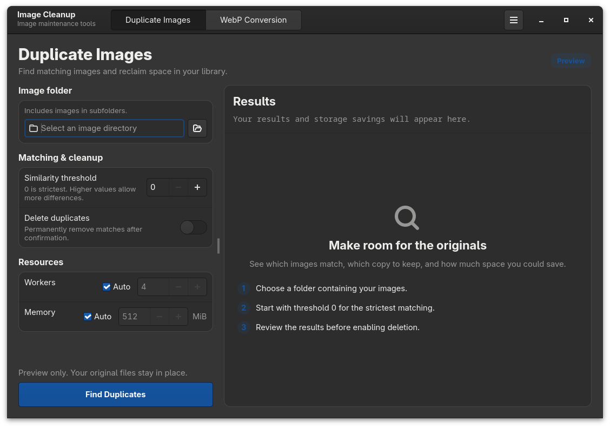
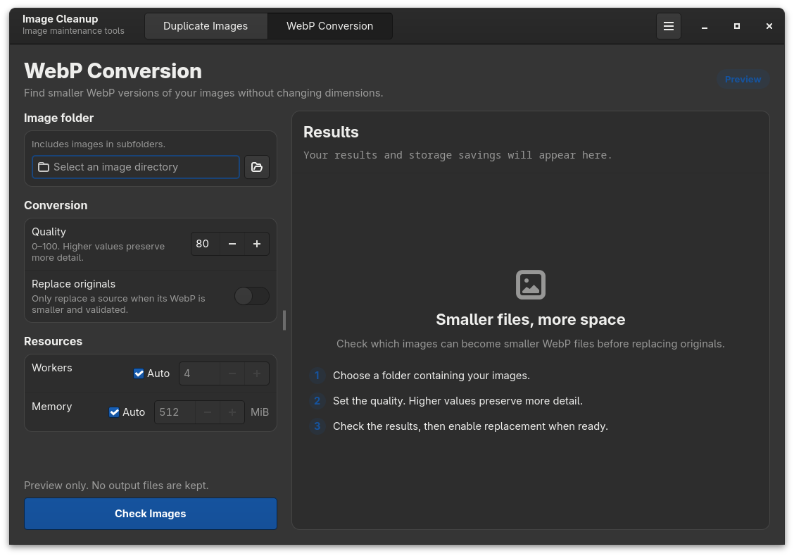

# Image Cleanup

Find duplicate images and convert images to smaller WebP files. Image Cleanup
provides the `cleanup-cli` command and an optional GTK application for Linux.

## Features

- Find visually matching images using structural and color signatures, keeping
  the copy with the highest resolution and using file size to break ties.
- Convert images to WebP while preserving pixel dimensions, replacing sources
  only when the validated output is smaller.
- Preview changes with dry runs before enabling deletion or replacement.
- See results and storage savings as work completes, with configurable worker
  and memory limits.

## Screenshots

<table>
  <tr>
    <td align="center" width="50%">
      
      <br><strong>Find duplicate images</strong>
    </td>
    <td align="center" width="50%">
      
      <br><strong>Convert images to WebP</strong>
    </td>
  </tr>
</table>

## Installation

Requires Python 3.12 or newer. Install the command-line package in a virtual
environment:

```console
python -m pip install cleanup-cli
```

For the Linux GTK application, install its native prerequisites first, then:

```console
python -m pip install cleanup-gui
```

See the [installation guide](docs/installation.md) for environment setup and
Linux package requirements.

## Quick start

Preview duplicate removal or WebP conversion:

```console
cleanup-cli deduplicate /path/to/photos
cleanup-cli webp /path/to/photos
```

Launch the graphical interface:

```console
cleanup-gui
```

Both tools default to a dry run. Deleting duplicates or replacing originals
requires an explicit option; the GUI also asks for confirmation. Review the
results and keep backups before applying changes.

## Documentation

The [documentation](docs/README.md) covers command options, GUI controls,
image matching, resource limits, and path ordering.

## Contributing

Bug reports, feature requests, and pull requests are welcome. Use the
[issue tracker](https://github.com/amiralimollaei/cleanup-cli/issues) or read
[CONTRIBUTING.md](CONTRIBUTING.md) to get started.
