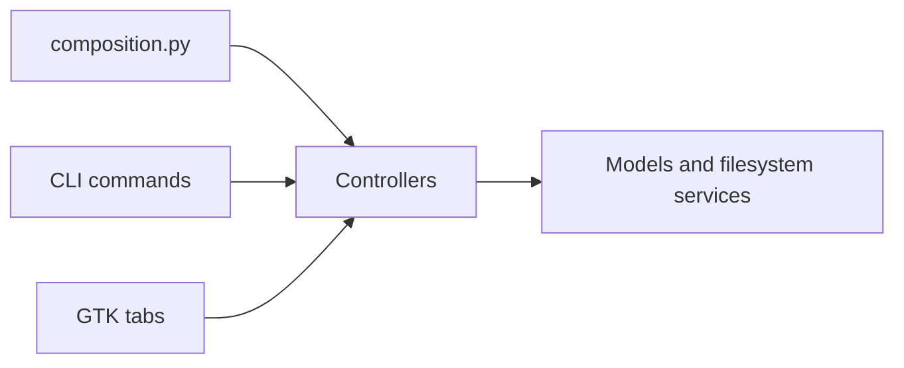

# Architecture

[README](../README.md) · [Installation](installation.md) ·
[Contributing](../CONTRIBUTING.md)

The package uses Model View Controller boundaries so the CLI and GTK application
share image operations while owning their own presentation.

| Location | Responsibility |
| --- | --- |
| [`models/`](../src/cleanup_cli/models/) | Image policies, filesystem operations, ordering, caching, memory limits, and reusable services. |
| [`controllers/core.py`](../src/cleanup_cli/controllers/core.py) | Immutable requests and results, plus controllers that invoke models. |
| [`views/`](../src/cleanup_cli/views/) | Argument and form input, progress and result presentation, and interface lifecycle. |
| [`composition.py`](../src/cleanup_cli/composition.py) | Construction of the concrete production models and controllers shared by both interfaces. |

## Production composition

`create_cleanup_controllers()` builds the image deduplicator and Pillow WebP
converter, wraps them in their controllers, and returns a `CleanupControllers`
dataclass. `create_cli_view()` registers command views around those controllers;
`create_gui_view()` registers GTK tabs around the same controller setup.



The CLI entry point is `cleanup_cli.main`; the GTK entry point is
`cleanup_cli.gui.main`. GTK imports occur when the GUI is loaded, so importing
the core package and running the CLI does not require PyGObject.

## Requests, results, and observers

Views create frozen request dataclasses containing the directory, validated
options, and optional result and progress observers. Controllers return frozen
result dataclasses with tuples of duplicates, conversions, or skips. Models own
the actual image and filesystem operations; controllers and views do not
reimplement their policies.

An `on_result` callback provides completed items while execution is still in
progress. The return value always contains the complete result, including every
streamed item. Production controllers stream completed items as they arrive;
custom controllers may stream some items or none. Views reconcile those events
with the complete result after successful execution.

The CLI's [`ResultReporter`](../src/cleanup_cli/views/commands/reporting.py)
centralizes this reconciliation. It identifies duplicates by the removed path
and WebP results by their result type and source path, prints streamed items
immediately, and prints any missing items at completion. A completion renderer
can use information only available in the final result, such as the final
deduplication deletion status. [`CliProgress`](../src/cleanup_cli/views/commands/progress.py)
coordinates output with an active progress bar.

GTK's shared controller tab queues worker callbacks for the GTK main loop and
drains them in bounded batches. Concrete tabs format the rows and final summary.
When the stream is incomplete, the tabs rebuild their rows from the complete
result. [`ResultList`](../src/cleanup_cli/views/gui/results.py) uses a GTK list
model and reuses widgets for visible rows.

## Reusable contracts

Protocols in [`models/abstractions.py`](../src/cleanup_cli/models/abstractions.py)
describe scanners, analyzers, memory estimators, distance metrics, path orderers,
and caches. The file remover has its own protocol in
[`models/deduplication.py`](../src/cleanup_cli/models/deduplication.py). Generic
abstract classes define indexer, detector, codec, and controller APIs.

These dependencies can be replaced by objects that implement the required
methods. Tests use that boundary to supply recorded results and controlled
filesystem behavior without changing the production composition.

The CLI exposes `ArgparseSubcommand` and `CliView` protocols. Each subcommand
registers its parser and handles its request and output; `ArgparseCliView`
registers arbitrary commands. Shared resource flags are defined once by
[`add_resource_arguments()`](../src/cleanup_cli/views/commands/arguments.py),
including their defaults, help text, and validation for positive integers.

## GTK module responsibilities

The GUI modules keep application setup, asynchronous execution, and reusable
controls separate:

| Module under `views/gui/` | Responsibility |
| --- | --- |
| [`application.py`](../src/cleanup_cli/views/gui/application.py) | Application shell, navigation, actions, styles, and the `GtkTab` protocol. |
| [`controller_tab.py`](../src/cleanup_cli/views/gui/controller_tab.py) | Background controller execution, progress, bounded result queues, completion, and shutdown. |
| [`tabs.py`](../src/cleanup_cli/views/gui/tabs.py) | Deduplication and WebP forms, request creation, result formatting, and shared tool form setup. |
| [`layout.py`](../src/cleanup_cli/views/gui/layout.py) | Responsive panels and divider positions shared across tools. |
| [`widgets.py`](../src/cleanup_cli/views/gui/widgets.py) | Setting groups, rows, optional numeric controls, and empty states. |
| [`dialogs.py`](../src/cleanup_cli/views/gui/dialogs.py) | Folder selection and confirmation of destructive actions. |
| [`theme.py`](../src/cleanup_cli/views/gui/theme.py) | Synchronization with GNOME's color-scheme preference. |
| [`results.py`](../src/cleanup_cli/views/gui/results.py) | Result rows and virtualized list presentation. |

## Register a custom tab

`GtkGuiView` accepts zero or any number of tabs. A tab needs a title, a symbolic
icon name, and a method that returns its GTK widget:

```python
import gi

gi.require_version("Gtk", "4.0")
from gi.repository import Gtk

from cleanup_cli.views.gui import GtkGuiView


class InformationTab:
    title = "Information"
    icon_name = "dialog-information-symbolic"

    def build(self) -> Gtk.Widget:
        return Gtk.Label(label="Custom cleanup tool")


GtkGuiView(InformationTab()).run()
```

Run the example in an environment prepared with the `gui` dependency group and
a working GTK display. Tabs performing cleanup operations can use
`ControllerGtkTab` for shared execution and presentation behavior.
